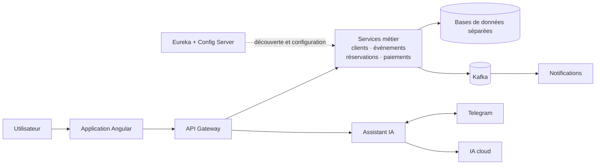

# Cahier des charges — TicketFlow

## Architecture cible

Le schéma décrit la cible, pas l’état déjà déployé. Eureka fournit l’adresse des services; le gateway reste le point d’entrée des clients. OpenFeign est réservé aux échanges synchrones qui ont besoin d’une réponse immédiate, tandis que Kafka transporte les événements qui peuvent être traités en différé. Chaque service métier demeure responsable de ses données. Docker Compose doit permettre de démarrer l’application et ses dépendances locales; Telegram et le fournisseur d’IA restent des services externes appelés par `ai-assistant-service`.

## Introduction

TicketFlow est une plateforme pédagogique de réservation de billets conçue pour faire passer un étudiant d’une application Spring Boot simple à un système distribué compréhensible, testable et présentable en entretien. Le domaine — événements, capacité limitée, réservations concurrentes, paiements simulés et notifications — permet d’illustrer des problèmes réels sans dépendre d’un fournisseur de paiement.

Le cahier des charges fixe une cible cohérente pour les fonctionnalités, l’architecture, la sécurité, les tests et la documentation. Il doit guider les prochaines étapes du dépôt GitHub tout en laissant les choix encore ouverts visibles et traçables. Le résultat attendu n’est pas seulement une démonstration qui démarre : un étudiant doit pouvoir expliquer les décisions, les compromis, les pannes prévues et la façon dont le système les traite.

## État actuel du dépôt

Le dépôt contient actuellement un monorepo Maven avec `customer-service` et `api-gateway`. Le premier gère des profils clients avec une base H2 en mémoire; le second expose une route statique vers le service client. Le fichier Compose ne lance pour l’instant que ces deux composants, et la CI GitHub Actions exécute `./mvnw verify` sur Java 21.

Les versions déclarées dans le POM racine sont Java 21, Spring Boot 4.0.8 et Spring Cloud 2025.1.2. La matrice officielle associe Spring Cloud 2025.1.x à Spring Boot 4.0.x et, à partir de 2025.1.2, à 4.1.x; la [publication de Spring Cloud 2025.1.2](https://spring.io/blog/2026/06/11/spring-cloud-2025-1-2-aka-oakwood-has-been-released) précise également les versions couvertes. Il faudra conserver les versions alignées via le BOM Spring Cloud et vérifier chaque évolution avec la CI.

Discovery/Eureka, Config Server, les services événements/réservations/paiement/notifications, Kafka, Angular, Telegram et l’assistant IA constituent la cible de ce document; leur présence dans le README ou la feuille de route ne signifie pas qu’ils sont déjà implémentés. Le dépôt décrit l’IA comme une étape ultérieure; le fournisseur cloud, le modèle, le budget et la politique de traitement des données ne sont pas encore définis.

## Objectifs et périmètre

Le projet doit permettre de parcourir des événements, de réserver des places et de suivre le résultat d’un paiement simulé. Il doit enseigner progressivement le routage, la découverte de services, la configuration centralisée, les appels REST déclaratifs, la résilience, les événements Kafka, la cohérence distribuée, l’observabilité, la sécurisation et l’intégration d’une interface Angular.

Le MVP pédagogique comprend le catalogue d’événements, les profils clients, le parcours de réservation, le paiement simulé, les notifications asynchrones et une interface web. Le bot Telegram et l’assistant alimenté par un service d’IA cloud sont une extension du MVP : ils doivent être isolés et leur indisponibilité ne doit jamais empêcher le parcours de réservation classique.

Les paiements réels, l’émission de billets auprès d’organisateurs tiers, une exploitation avec engagement de disponibilité, ainsi qu’un déploiement cloud public complet ne font pas partie du périmètre initial. Ils ne pourront être ajoutés qu’après une décision d’architecture explicite.

## Exigences métiers

### Acteurs

- **Visiteur** : consulte les événements publiés et leurs places disponibles.
- **Client** : gère son profil, réserve des places et consulte ses réservations.
- **Administrateur ou organisateur** : crée un événement, définit ses dates, son prix et sa capacité, puis le publie, le modifie ou le clôture.
- **Agent Telegram** : répond aux questions autorisées sur les événements et, après une association explicite du compte Telegram au compte client, sur les informations de réservation permises.

Les autorisations de chaque rôle devront être appliquées côté serveur; masquer un bouton dans Angular ne constitue pas un contrôle d’accès.

### Règles de gestion

1. Seuls les événements publiés et ouverts à la réservation sont proposés au public. La capacité totale est fixée avant l’ouverture des ventes et ne peut être abaissée sous le nombre de places déjà engagées.
2. Une réservation place temporairement les sièges en attente de paiement. La durée de cette réservation temporaire est configurable et documentée. Deux demandes concurrentes ne doivent jamais vendre la même place ni dépasser la capacité disponible.
3. Une réservation suit au minimum les états `PENDING_PAYMENT`, `CONFIRMED`, `PAYMENT_FAILED`, `EXPIRED` et `CANCELLED`. Les transitions valides sont contrôlées par `booking-service`, et chaque changement laisse une trace exploitable.
4. Le MVP utilise un fournisseur de paiement simulé. Une réservation n’est confirmée qu’après réception d’un résultat de paiement positif. Un échec ou une expiration libère la capacité retenue; la compensation est rejouable sans créer de doublons.
5. Toute création de réservation, commande de paiement ou consommation d’événement sensible est idempotente. Les répétitions d’une requête ou d’un message ne doivent pas créer plusieurs réservations, paiements simulés ou notifications.
6. La confirmation de réservation et le résultat du paiement déclenchent des notifications asynchrones. Un échec du service de notification ne doit pas annuler une réservation déjà confirmée.
7. Les recommandations de l’assistant IA sont informatives. L’agent peut rechercher et résumer des informations autorisées, mais ne peut ni confirmer une réservation, ni effectuer un paiement, ni annuler une commande ou modifier un profil de sa propre initiative.

## Exigences fonctionnelles

- **RF-01 — Catalogue** : afficher la liste des événements publiés, leur date, lieu, prix et disponibilité; permettre une recherche/filtration simple et consulter le détail d’un événement.
- **RF-02 — Comptes clients** : créer et mettre à jour un profil client, valider les données saisies et empêcher les doublons de courriel selon les règles du service.
- **RF-03 — Gestion des événements** : autoriser les rôles d’administration à créer, modifier, publier et clôturer un événement; exposer au public uniquement les informations publiables.
- **RF-04 — Réservation** : créer une réservation pour un événement ouvert, vérifier la capacité atomiquement, renvoyer son identifiant et son état, et empêcher la surréservation sous concurrence.
- **RF-05 — Paiement simulé** : lancer une simulation de paiement, représenter succès, refus et indisponibilité, et faire évoluer la réservation selon le résultat reçu.
- **RF-06 — Cohérence distribuée** : appliquer une saga de réservation/paiement avec actions de compensation documentées; rendre visibles les transitions et les cas de reprise.
- **RF-07 — Notifications** : produire des événements de domaine et les consommer pour envoyer une notification de confirmation ou d’échec. En environnement local, un adaptateur simulé suffit; tout vrai canal d’envoi reste soumis à configuration explicite.
- **RF-08 — Interface Angular** : fournir les vues catalogue, détail, réservation, profil et suivi des réservations; afficher clairement les erreurs, l’attente de paiement et l’indisponibilité.
- **RF-09 — Assistant Telegram** : recevoir une question via le Bot API, renvoyer une réponse utile et limitée aux données autorisées, et expliquer quand il ne peut pas répondre. La liaison entre un identifiant Telegram et un compte client nécessite un mécanisme explicite et révocable.
- **RF-10 — Assistant IA cloud** : générer des réponses en langage naturel à partir d’informations contrôlées sur les événements et les réservations associées. Les réponses ne sont pas une source de vérité; le système vérifie les informations transactionnelles dans les services métier.
- **RF-11 — Administration et diagnostic** : permettre aux développeurs d’inspecter les états de santé, les routes et les événements nécessaires au débogage, sans exposer de données personnelles ni de secrets dans les journaux.
- **RF-12 — Parcours dégradé** : si Telegram, le fournisseur d’IA, Kafka ou le service de notification est indisponible, présenter un état explicite et préserver la navigation et les fonctions principales selon la nature de la panne.

## Exigences techniques

### Services et échanges

- **API Gateway** : unique entrée des interfaces; routes vers les services à partir des identifiants découverts, filtres de sécurité et de corrélation, validation de base des requêtes et limitation de débit configurable. Les services ne doivent pas être exposés directement au navigateur en déploiement Compose.
- **Discovery Server** : registre Eureka pour l’enregistrement et la résolution dynamique des instances. Les tests doivent couvrir le routage vers un service découvert et le comportement quand une instance est absente.
- **Config Server** : configuration externe par service et par profil. Les valeurs non secrètes peuvent être versionnées dans un dépôt de configuration; les clés, mots de passe et jetons ne doivent pas être enregistrés dans Git.
- **OpenFeign** : client déclaratif pour les besoins synchrones identifiés, en particulier la validation du catalogue ou la demande de paiement. Les délais d’attente doivent être bornés; les retries sont limités aux opérations sûres ou rendues idempotentes.
- **Resilience4J** : circuit breaker, time limiter et mécanismes de repli adaptés aux appels réseau. Ne pas répéter automatiquement une commande de paiement non idempotente; les états de repli doivent rester visibles au client.
- **Kafka** : transport des événements de réservation, paiement, disponibilité et notification. Les schémas d’événement sont versionnés, les consommateurs idempotents, les erreurs observables, et les messages non traités disposent d’une stratégie de reprise documentée. L’Outbox est à privilégier pour éviter la divergence entre une écriture en base et la publication d’un événement.

### Frontend et assistant

- **Angular** : application SPA, appels API uniquement à travers le gateway, contrats TypeScript maintenus avec les API, configuration d’environnement sans secret et gestion cohérente des erreurs/chargements. La version Angular sera choisie lors de la création de l’application puis figée par le gestionnaire de paquets.
- **Telegram** : `ai-assistant-service` est l’unique adaptateur du Bot API. Le choix entre webhook et long polling est à consigner dans un ADR; le jeton du bot est fourni à l’exécution, les messages entrants sont validés, le débit est limité et les erreurs du fournisseur sont traitées sans bloquer les services métier.
- **IA cloud** : l’accès au modèle passe par une interface/adaptateur isolé. Spring AI est une option pertinente pour réduire le couplage fournisseur et prendre en charge des fonctions telles que les appels d’outils; ce document ne choisit pas de fournisseur. Avant l’intégration, un ADR doit comparer qualité, disponibilité, coût, région de traitement, rétention, conditions d’utilisation, garde-fous et possibilité de changer de fournisseur. Les appels d’outils doivent être en liste d’autorisation et en lecture seule pour le MVP.
- **Docker** : chaque service applicatif et le frontend doit disposer d’une image reproductible, avec utilisateur non-root si possible, contrôle de santé et configuration par variables d’environnement. Docker Compose doit lancer le parcours local complet, les dépendances nécessaires et des volumes de données explicites. Les secrets sont fournis localement par `.env` ignoré par Git ou par un gestionnaire de secrets en environnement distant; un `.env.example` sans valeur réelle est documenté.

### Données et contrats

Chaque service métier possède sa base ou son schéma logique et demeure seul responsable des écritures sur ses données. Les autres services passent par API ou événements Kafka; aucune jointure directe entre bases de services n’est autorisée. Les migrations de schéma sont versionnées et testées.

Les API REST utilisent JSON, des codes HTTP cohérents, une validation serveur, des contrats OpenAPI maintenus et une stratégie de compatibilité/versionnement. Les erreurs suivent un format stable; `customer-service` utilise déjà `ProblemDetail` (RFC 9457), qui peut servir de modèle commun. Les horodatages sont stockés dans un format non ambigu et présentés dans le fuseau adapté à l’utilisateur.

### Sécurité et confidentialité

L’authentification centralisée et l’autorisation par rôles doivent être intégrées progressivement; Keycloak figure déjà dans la feuille de route du dépôt comme option cible. Chaque service sensible vérifie les permissions nécessaires, même lorsque la requête arrive par le gateway. Les règles CORS, la protection contre les abus et les limites de taille des requêtes sont configurées explicitement.

Les données personnelles sont limitées au strict besoin métier, masquées dans les logs et accompagnées de règles de conservation/suppression documentées. Avant tout envoi vers l’IA cloud, seules les informations indispensables sont transmises et l’utilisateur est informé de l’usage du canal; les données de paiement réelles et les secrets ne sont jamais envoyés au modèle. L’intégration Telegram doit permettre de révoquer l’association au compte client. Le jeton Telegram, les clés IA et les mots de passe ne sont jamais committés.

## Exigences non fonctionnelles

- **Robustesse** : une panne de l’assistant ou des notifications n’interrompt pas la réservation. Les dépendances distantes ont des timeouts, les erreurs sont explicites et les opérations critiques sont rejouables sans effets de bord.
- **Cohérence** : les tests de concurrence démontrent qu’une capacité finie ne peut être dépassée; chaque scénario de saga, compensation et rejeu est documenté.
- **Observabilité** : chaque requête possède un identifiant de corrélation propagé entre gateway et services. Actuator et Micrometer exposent les états utiles; les logs structurés permettent de suivre une réservation de bout en bout sans afficher de secrets ou de données sensibles. Le tracing distribué est ajouté à l’étape observabilité.
- **Maintenabilité** : modules Maven clairement séparés, conventions de nommage, dépendances alignées par BOM, configuration extérieure et décisions d’architecture enregistrées dans des ADR courtes.
- **Tests et intégration continue** : tests unitaires du domaine, tests d’intégration des API et de persistance, tests de contrat entre services, tests de flux Kafka et tests de bout en bout du parcours principal. Chaque Pull Request lance compilation, tests et vérifications de qualité; le dépôt doit rester reproductible depuis un clone propre.
- **Performance de référence** : établir un test reproductible du catalogue et des réservations dans l’environnement Docker de référence. Une première cible de validation proposée est 50 utilisateurs virtuels, sans survente, avec un p95 inférieur à 2 s pour la lecture du catalogue et à 3 s pour la réservation (hors latence du fournisseur IA). La machine, le jeu de données et les résultats doivent être consignés; cette cible est à confirmer avant d’en faire un engagement de production.
- **Accessibilité et ergonomie** : navigation utilisable au clavier, libellés compréhensibles, messages d’erreur actionnables, et adaptation aux écrans mobiles courants.

## Exigences pédagogiques et préparation à l’emploi

Chaque étape de la feuille de route doit correspondre à une évolution fonctionnelle et à une leçon courte : problème observé, décision retenue, mise en œuvre, test de démonstration, erreur fréquente et exercice. Les étudiants doivent pouvoir lancer un sous-ensemble, exécuter ses tests et comprendre ses dépendances avant de passer à l’étape suivante.

Le dépôt doit servir de portfolio technique. Il doit rendre visibles les pratiques attendues dans une candidature junior backend/full-stack : Git par branches et Pull Requests, commits explicites, CI verte, tests automatisés, contrat d’API, code lisible, sécurité de base, conteneurisation, gestion des erreurs, documentation des décisions et démonstration des compromis. Chaque exercice ou tâche devrait préciser son objectif d’apprentissage et ses critères d’acceptation plutôt que demander seulement « d’ajouter une fonctionnalité ».

Les démonstrations et exemples doivent distinguer les compromis d’un environnement pédagogique des exigences d’un système de production. Les choix de paiement simulé, d’authentification, de base de données et de fournisseur IA sont explicitement qualifiés afin que les étudiants puissent en discuter sans les présenter comme des garanties de production.

### Compétences à acquérir et à valoriser

Les compétences ci-dessous sont des **objectifs d’apprentissage**, pas une déclaration que tous les modules existent ou sont déjà maîtrisés. Elles s’acquièrent progressivement en suivant la feuille de route. Pour chaque compétence présentée comme acquise dans un portfolio ou une candidature, l’étudiant doit pouvoir montrer une réalisation présente dans le dépôt et l’expliquer; se référer à la section [État actuel du dépôt](#état-actuel-du-dépôt) pour distinguer l’implémenté du planifié.

#### Parcours principal

| Domaine | Compétences visées | Étapes et preuves à présenter |
|---|---|---|
| Java et Spring | Développer des services avec Java 21 et Spring Boot, structurer le code métier, exposer des API REST, valider les entrées et persister les données avec Spring Data JPA. | Socle et services métier; endpoints documentés, tests et gestion cohérente des erreurs. |
| Microservices et Spring Cloud | Délimiter les responsabilités des services, comprendre la propriété des données et assembler les composants d’un système distribué; configurer Spring Cloud Gateway, Eureka et Spring Cloud Config. | Gateway, découverte et configuration centralisée (étapes 02 à 05 de la roadmap); montrer un routage dynamique et une configuration par profil une fois ces modules réalisés. |
| REST et OpenFeign | Définir et maintenir des contrats JSON/OpenAPI, choisir entre appel synchrone et événement asynchrone, appeler un service avec un client REST déclaratif et borner les délais d’attente. | Étape `step-06-booking-feign`; contrat et tests d’un échange interservices réel. |
| Résilience et cohérence distribuée | Traiter les indisponibilités avec timeouts et circuit breakers, limiter les retries aux opérations sûres, rendre les commandes idempotentes et gérer concurrence, saga et compensations. | Étapes `step-07-resilience` et `step-09-saga`; tests reproductibles de panne, de rejeu et de capacité sans survente. |
| Événementiel avec Kafka | Modéliser des événements, produire et consommer des messages, gérer doublons et erreurs de traitement, et comprendre l’intérêt de l’Outbox. | Étape `step-08-kafka` puis saga; démonstration d’un flux asynchrone et des tests de reprise/idempotence. |
| Frontend Angular | Construire une interface web de catalogue et de réservation qui consomme les API via le gateway, et traiter les états de chargement, d’erreur et d’indisponibilité. | Module `web-frontend` prévu dans la roadmap; démonstration du parcours utilisateur complet lorsqu’il sera implémenté. |
| Docker, tests et CI | Conteneuriser les composants, démarrer un environnement reproductible avec Docker Compose, écrire des tests unitaires et d’intégration et vérifier les changements par une CI. | Socle et progression des services; commandes documentées, tests exécutés et pipeline vert. Ajouter les tests de contrat et de bout en bout au fur et à mesure de leur réalisation. |
| Sécurité et observabilité | Appliquer authentification et autorisation côté serveur, protéger les secrets et données personnelles, puis diagnostiquer un flux grâce aux logs corrélés, métriques et traces. | Étapes `step-10-security` et `step-11-observability`; tests d’accès et démonstration du suivi d’une requête à travers plusieurs services. |

#### Extensions avancées ou optionnelles

- **Telegram** : intégrer le Bot API derrière `ai-assistant-service`, valider et limiter les messages, contrôler les données accessibles et traiter les erreurs du canal externe. Cette extension est planifiée après les fonctions principales; webhook/polling et liaison des comptes restent à décider. Elle ne doit pas être présentée comme une compétence démontrée tant que l’intégration et ses tests ne sont pas dans le dépôt.
- **IA cloud** : intégrer un fournisseur derrière un adaptateur (Spring AI est une option de la roadmap), maîtriser les réponses en lecture seule et les outils autorisés, et évaluer qualité, coût, disponibilité et confidentialité. Le fournisseur et le modèle ne sont pas encore choisis; cette extension dépend des décisions consignées dans un ADR et de l’étape `step-12-ai`.

#### Présenter le projet sans surévaluer l’avancement

Tant qu’une étape n’est pas construite, la décrire comme **prévue**, **en cours** ou comme un objectif d’apprentissage, et non comme une réalisation ou une expertise acquise. Une formulation possible pour un projet en cours est : « Je construis progressivement TicketFlow, une plateforme de réservation pédagogique, en suivant une roadmap Java/Spring vers les microservices; les modules terminés et leurs tests sont indiqués dans le dépôt. »

Après réalisation, préférer une description vérifiable et précise, par exemple : « J’ai implémenté [module/fonction] avec [technologies], validé par [tests/scénario démontré]; [limite ou étape suivante] reste à faire. » Ne citer que les technologies et résultats effectivement présents dans la version montrée, et distinguer explicitement les extensions Telegram/IA encore optionnelles ou planifiées.

## Documentation et livrables attendus dans GitHub

Le dépôt doit inclure au minimum :

- ce cahier des charges et un README racine qui explique le projet, les prérequis, le démarrage, les ports et les liens vers les documents;
- un schéma d’architecture maintenu à jour et un README par service avec rôle, dépendances, endpoints, configuration, exécution, tests et exercices;
- un guide de démarrage local, un `.env.example`, les commandes Docker Compose et les procédures de réinitialisation des données;
- les contrats OpenAPI, les formats d’événements Kafka, les règles de sécurité et les principaux scénarios de réservation;
- des ADR pour les choix encore ouverts, notamment le fournisseur et le modèle IA, Telegram webhook/polling, la liaison des comptes Telegram, les données, les versions frontend et les conditions d’hébergement;
- des leçons alignées sur les tags ou étapes de la feuille de route, des exemples de requêtes, les résultats attendus et des consignes de contribution.

Une personne qui découvre le dépôt doit pouvoir comprendre la cible, démarrer la première partie fonctionnelle et trouver les prochaines étapes sans dépendre d’explications privées.

## Découpage de réalisation proposé

Le découpage conserve la progression annoncée dans le README :

1. **Socle** : POM, service client, gateway et CI; fiabiliser les README et le lancement Compose.
2. **Routage dynamique et configuration** : Eureka, routes `lb://`, Config Server et configuration par profil.
3. **Catalogue** : `event-service`, persistance et API de consultation/administration.
4. **Réservation** : `booking-service`, OpenFeign, verrouillage/gestion de capacité, états et tests de concurrence.
5. **Paiement simulé et résilience** : timeouts, circuit breaker, idempotence et compensation.
6. **Événements et notifications** : Kafka, consommation idempotente, reprise et Outbox.
7. **Sécurité et observabilité** : authentification/autorisation, métriques, logs corrélés et traces.
8. **Interface web** : application Angular couvrant le parcours utilisateur de bout en bout.
9. **Assistant Telegram et IA** : après validation des décisions fournisseur/confidentialité, implémenter l’adaptateur Telegram et les fonctions IA en lecture seule.
10. **Polissage portfolio** : tests de bout en bout, documentation, démonstration, issues/PR pédagogiques et vérification du démarrage depuis un clone propre.

Les étapes peuvent être ajustées selon la progression pédagogique, mais les dépendances et critères de fin doivent rester visibles dans la feuille de route et les leçons.

## Critères d’acceptation du projet

Le projet est prêt à être présenté comme portfolio lorsque :

1. un clone propre réussit `./mvnw -B -ntp verify` et les instructions de démarrage local aboutissent sans secret intégré au dépôt;
2. le parcours catalogue → réservation → paiement simulé → confirmation est démontrable via Angular et le gateway;
3. un test de concurrence prouve l’absence de survente et les scénarios d’échec libèrent les places correctement;
4. Eureka et Config Server sont visibles et expliqués, OpenFeign est utilisé pour un besoin synchrone réel et Kafka pour au moins un flux asynchrone démontrable;
5. les pannes testées (service indisponible, paiement refusé, message rejoué, IA/Telegram indisponible) produisent des comportements attendus et documentés;
6. les secrets sont absents de l’historique Git, les permissions sont contrôlées côté serveur et les appels de l’agent IA restent en lecture seule;
7. Docker Compose et les documents permettent à un autre étudiant de lancer, tester et expliquer les composants sans aide individuelle;
8. la CI est verte et les limites connues, versions, instructions et décisions d’architecture correspondent réellement au contenu du dépôt.

## Décisions à confirmer avant les étapes concernées

- Quel fournisseur/modèle d’IA cloud est acceptable au regard du budget, de la confidentialité, de la région et de la qualité attendue? Spring AI est une option d’intégration, pas un fournisseur sélectionné.
- Le bot Telegram utilisera-t-il un webhook ou un polling, et comment l’utilisateur associera-t-il son compte au bot?
- Quelle version Angular et quelle stratégie d’authentification (notamment l’intégration Keycloak prévue dans la feuille de route) seront retenues?
- Quelle politique de conservation/suppression des données personnelles et de consentement s’applique aux messages envoyés au bot et au fournisseur IA?
- Quelle licence open source et quel environnement de déploiement sont souhaités?
- Les objectifs de performance proposés ci-dessus sont-ils adaptés à la machine de référence et au public visé?

Ces décisions devront être consignées dans des ADR avant leur implémentation. Tant qu’elles ne sont pas prises, les composants concernés restent configurables et ne doivent pas être présentés dans le README comme des choix déjà adoptés.
